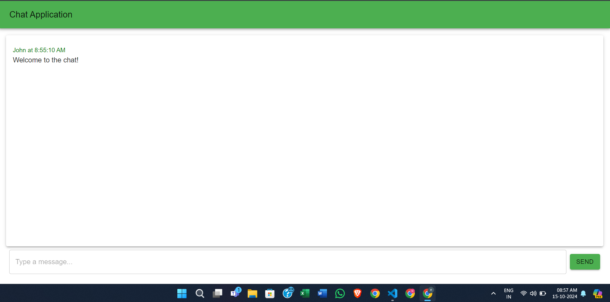
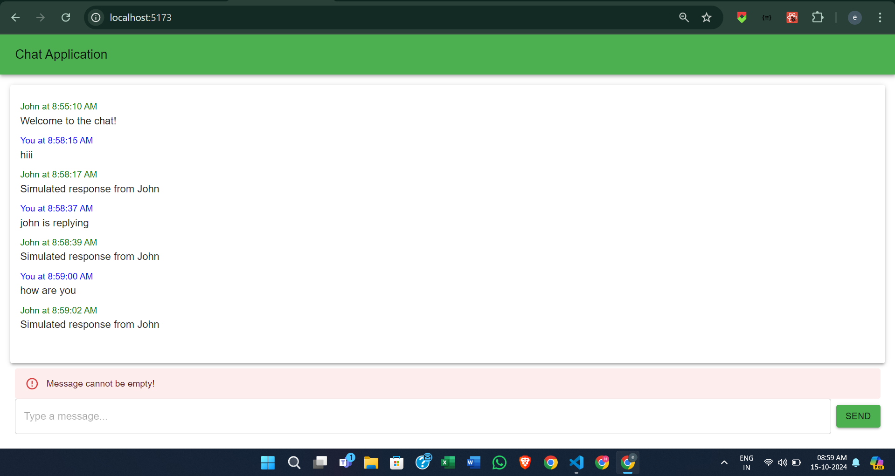
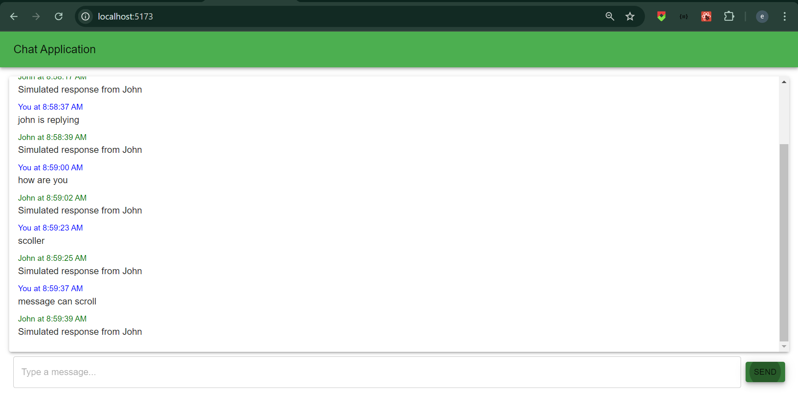
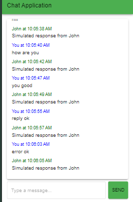

# Chat Application - Frontend

This is a responsive chat interface built using **React**, **Material UI (MUI)**, **Redux Toolkit (RTK)**, and **Vite**. It provides a visually appealing interface with chat functionalities such as sending and receiving messages, displaying timestamps, and ensuring that the UI is fully responsive across devices.

## Features

- **Message Input**: Users can type and send messages via the input field and send button.
- **Chat Display**: Displays both sent and received messages in a scrollable window.
- **Timestamps**: Each message shows the time it was sent.
- **Auto-scroll**: Automatically scrolls to the latest message in the chat window.
- **Responsive Design**: Fully responsive UI using MUI, ensuring the chat interface adapts across various screen sizes (including mobile).
- **Redux Toolkit for State Management**: Uses RTK to manage chat state (messages, user info).
- **Simulated Message Reception**: Mock messages are received with a delay using `setTimeout`.
- **React 18 Features**: Leverages React 18 features like automatic batching.

## Technologies Used

- **React 18**
- **Vite** (for development and building)
- **Material UI (MUI)** (for responsive design and components)
- **Redux Toolkit (RTK)** (for state management)
- **React Hooks** (for state management and lifecycle)
- **Flexbox & CSS** (for layout and responsiveness)

## Screenshots

### Desktop View





### Mobile View



## Setup and Installation

### Prerequisites

Make sure you have the following installed:

- [Node.js](https://nodejs.org/)
- [Yarn](https://classic.yarnpkg.com/) (or use npm)

### Steps to Run Locally

1. Clone this repository:

    ```bash
    git clone https://github.com/yourusername/chat-app.git
    cd chat-app
    ```

2. Install dependencies:

    ```bash
    yarn install
    ```

    Or, if you prefer `npm`:

    ```bash
    npm install
    ```

3. Start the development server:

    ```bash
    yarn dev
    ```

    Or, if using `npm`:

    ```bash
    npm run dev
    ```

4. Open your browser and go to:

    ```
    http://localhost:3000
    ```

### Build for Production

To build the app for production, run:

```bash
yarn build
